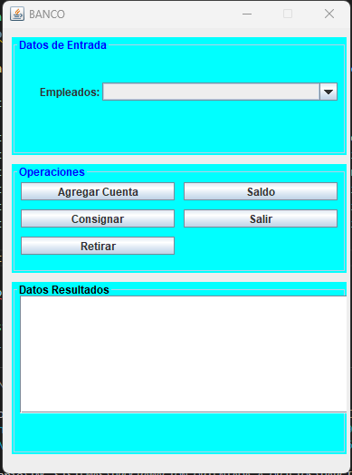

# PARCIAL #2 PROGRAMACION ORIENTADA A OBJETOS 

En un banco se tienen varios tipos de cuentas bancarias  en las cuales es posible retirar fondos y hacer depositos. Consideremos tres tipos de cuentas: 
-Corriente
-Ahorro
-Libreta 2022

Las cuentas corrientes se utilizan para realizar pagos y no proporcionan ningun interes. Por otro lado, las cuentas de ahorro proporcionan un interes del 4%. La libreta 2022 es un tipo de cuenta de ahorro rinde un mayor interes del 8% pero la retirada de fondos esta penalizada con 2% de la cantidad retirada.

En estas condiciones:
1. Construir el diagrama de clases requerido.
2. Programar las clases necesarias.
3. La app debe permitir crear objetos de las distintas clases, inicializando las cuentas con un valor inicial. Ademas, debe permitir consingar y retirar fondos de cada una de las cuentas, actualizando saldos y respectivos intereses.

## PANTALLAZOS
