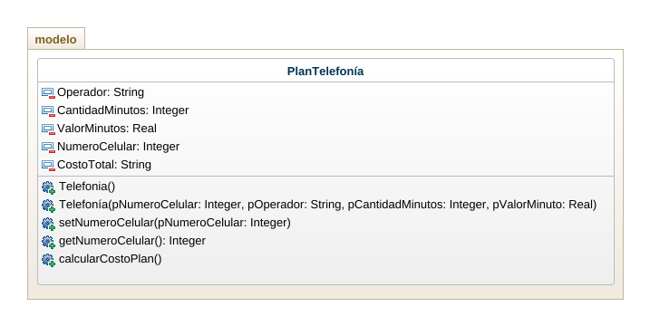
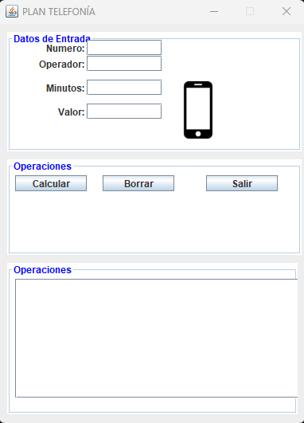
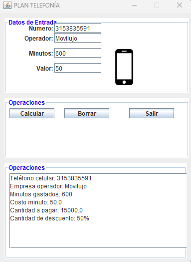

## PLAN TELEFONÍA

Crear un programa para gestionar un plan de telefonía móvil. El plan tiene un número de celular, un operador, una cantidad de minutos y un costo por minuto. Calcular el total a pagar  teniendo en cuenta si el operdor es "movilujo" tiene un descuento del 50% de descuento. Usar mínimo dos métodos costructores.

